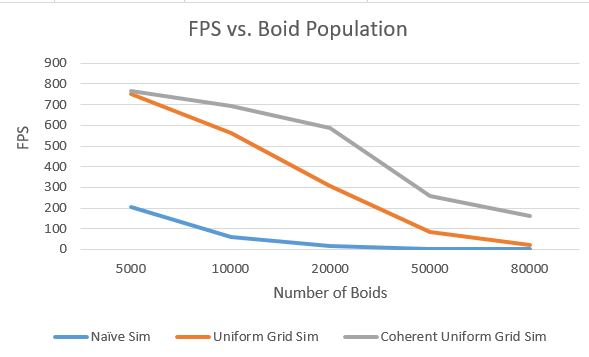
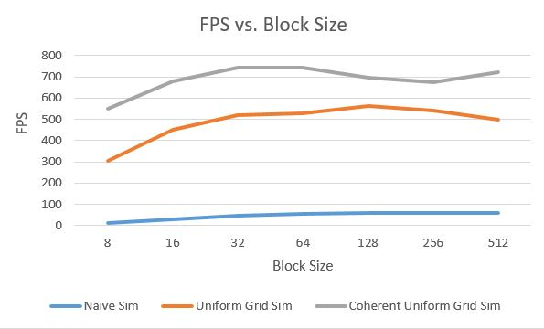

**University of Pennsylvania, CIS 565: GPU Programming and Architecture,
Project 1 - Flocking**

* Tabatha Hickman
  * LinkedIn: https://www.linkedin.com/in/tabatha-hickman-335987140/
* Tested on: Windows 10 Pro, i7-5600U CPU @ 2.60GHz 16GB, GeForce 840M (personal computer)

 

## Boids Simulation

This project simulates a set of particles which exhibit flocking behavior. On each time step, each particle's velocity and position is updated according to some rules. In this implementation, three behavioral animation rules were used. Cohesion, which causes a boid to move toward the center of its neighbors, Separation, which keeps the boid from getting to close to any of its neighbors, and Alignment, which makes a boid move with the same general velocity as its neighbors. To compute a new velocity using these rules, we need to find all the neighboring boids to this one. This is not a simple task, as bad decisions can make big differences as we increase the number of boids in the scene. I have implemented three types of simulations, each of which performs this neighbor check in different ways:

1. The Naive simulation simply checks every other boid in the scene and checks to see if its distance is less than the search distance. This obviously does a lot more checking than it needs to, since the majority of the other boids will be nowhere near the one we are checking.

2. The Uniform Grid simulation creates a 3D grid around the space of the boids, keeps track of which boids are in which cells, and only checks the surrounding grid cells to the one we are checking for possible neighbors within the search radius. As long as the cell width of the grid is greater than or equal to the search radius, we only need to check a few other cells or other boids.

3. The Coherent Grid Simulation is the same as the Uniform Grid, but with one small difference. In the implementation, we have buffers holding positions and velocities. When we add in information about which boids are in which cells, we need to add new buffers which say which index in the grid buffers corresponds to which index in those position and velocity buffers. By adding a kernel to reorder the position and velocity buffers to match the order of the grid indexes, we remove that extra buffer and optimize the simulation.

## Performance Analysis

Times were recorded by running the simulation without visualization (purely measuring simulation time), letting the simulation settle for a few seconds, and recording an average of the framerate reported in the window title.

### Population of Boids

(with block size of 128)

As the number of boids in the scene increases, the performance gets worse for all implementations. This is somewhat obvious because the more boids there are, the more computation needs to be done, as each boid needs to have its position and velocity updated. The naive implementation gets worse faster because not only do we have to update each boid, but each boid is checking every other boid. The incoherent uniform grid also seems to get worse faster than the coherent implementation, which I will address later.

### Block count and block size

(with 10,000 boids)

As we increase the block size, it looks like the performance improves up until about 32, where it begins to plateau. This makes sense because if we limit the block size, we limit how many threads can run at the same time, and thus we have to wait longer to complete a whole simulation step. The plateau probably occurs because the warp size is 32, so we can't schedule more than 32 threads at a time.

### Coherent vs Incoherent Uniform Grid

The difference between the coherent and incoherent approaches seems to be negligible at smaller boid populations, but increases as the boid population increases. I was unsure of what to expect when measuring this. Removing the middle man by creating coherent versions of the pos and vel buffers seems like it would improve performance because during the velocity calculation an extra lookup needs to be done with every boid in the neighboring cells per boid that we update. On the other hand, we had to create a new kernel to make the new buffers coherent and this needs to do some buffer setting on every boid in the scene. It makes sense that the improvement outweighs the cost because the line that we remove would get called N (number of boids in scene) * n (number of boids in search radius) times, while the lines in the kernel we add only get called N times.

### Cell Width of Uniform Grid

For the approaches which used the uniform grid, the cell width will affect how many neighboring cells will need to be checked. If we make the cell width double the search distance, we only need to check 8 neighboring cells, but if we make the cell width equal to the search distance, we must check the 27 neighboring cells to the one this boid is in. I tested the framerates produced from both these approaches and there seems to be little difference. I think this might be because the major computation involved is on a per boid basis. No matter whether were checking 8 or 27 cells, we still find the same number of boids in the search radius and have to do computations related to the boid algorithms on each one of them. The only difference is some overhead of needing to get the start and end indices for each cell, which make checking 27 slightly worse, but this seems to be negligible.
